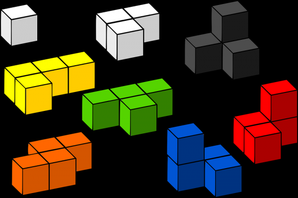

# galsan-algorithm
 This project is for studying Algorithm of Galsan-dong members.
 
 
<small>출처 : http://www.econovill.com/news/articleView.html?idxno=314816</small>

**************
## Compile
* Andrew : 크롬에 접속한다. 윈도우의 경우 ctrl+o, 맥의 경우 cmd+o 를 누르고 해당 파일을 연다.  
           (1주차의 경우 : WWW/galsan-algorithm/andrew/src/week1/index.html)

**************

## 1주차 
Q. 1  https://www.acmicpc.net/problem/10870  
Q. 2  https://www.acmicpc.net/problem/2557  
Q. 3  https://www.acmicpc.net/problem/1463  
Q. 4  https://www.acmicpc.net/problem/10872  

***************
